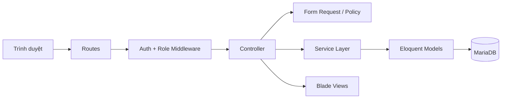

# Kiến trúc hệ thống

## Kiến trúc ứng dụng

Ứng dụng dùng Laravel MVC kết hợp Service Layer. Route nhận request, middleware xác thực role, Form Request kiểm tra dữ liệu, controller kiểm tra quyền rồi chuyển nghiệp vụ sang service. Service mở transaction và thao tác Eloquent; controller trả về Blade hoặc redirect cùng flash message.

## Service Layer

- `AppointmentService`: đặt lịch, xác nhận, hủy, hoàn sức chứa và tiếp nhận.
- `ExaminationService`: bắt đầu, lưu và hoàn thành bệnh án.
- `PrescriptionService`: kiểm tra thuốc trùng, số lượng và chụp giá bán.
- `InvoiceService`: tính tiền server-side, khóa tồn kho và thanh toán từng phần.
- `ReportService`: KPI và dữ liệu biểu đồ.
- `ActivityLogService`: ghi nhận đăng nhập và hành động quan trọng.

## Luồng chính

1. Đặt lịch khóa `doctor_schedules`, kiểm tra slot 30 phút và tăng `booked_patients`.
2. Tiếp nhận sinh số thứ tự theo bác sĩ/ngày, tạo phiếu khám duy nhất.
3. Bác sĩ được phân công bắt đầu khám, lưu bệnh án, kê đơn và hoàn tất.
4. Lễ tân lập hóa đơn từ dịch vụ và đơn thuốc; hệ thống trừ tồn kho trong transaction.
5. Mỗi payment cập nhật lại `paid_amount` và trạng thái hóa đơn.

## Bảo mật

Session authentication, CSRF, Hash password, role middleware, policy theo quyền sở hữu, Form Request, fillable, escape Blade và khóa tài khoản. Giá/tổng tiền/role không lấy trực tiếp từ client.
