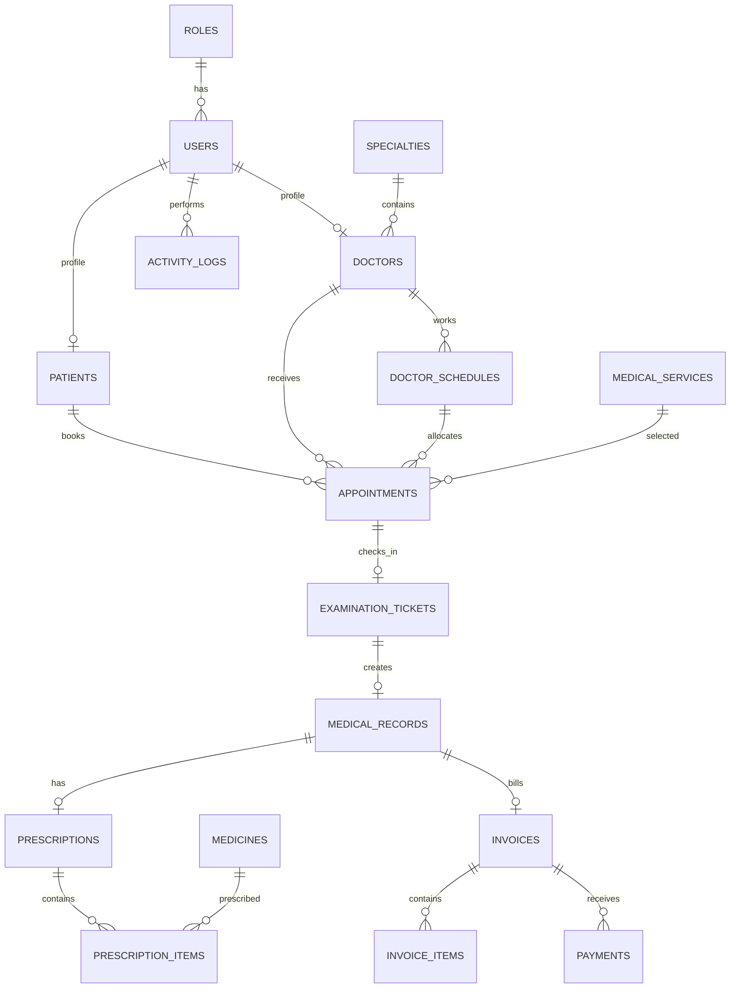

# Thiết kế cơ sở dữ liệu

Database dùng InnoDB, `utf8mb4_unicode_ci` và múi giờ ứng dụng `Asia/Ho_Chi_Minh`. Trạng thái lưu bằng varchar và được kiểm soát bởi model constants/service.

## Quy tắc khóa và xóa

- Unique: role code, user email, các mã nghiệp vụ, user-patient, user-doctor, ticket-appointment, record-ticket, prescription-record và invoice-record.
- Index: tên/mã/điện thoại bệnh nhân, ngày/trạng thái lịch, bác sĩ-slot, trạng thái hóa đơn và thuốc.
- Soft delete: users, patients, specialties, doctors, medical services, medicines và appointments.
- Dữ liệu đã có lịch sử y tế/hóa đơn không xóa cứng. Khóa ngoại nghiệp vụ dùng `restrict`; liên kết tài khoản hoặc người thao tác có thể `nullOnDelete`.
- `invoice_items.reference_id` là tham chiếu snapshot có chủ đích; không đặt foreign key vì có thể trỏ tới dịch vụ hoặc thuốc.
